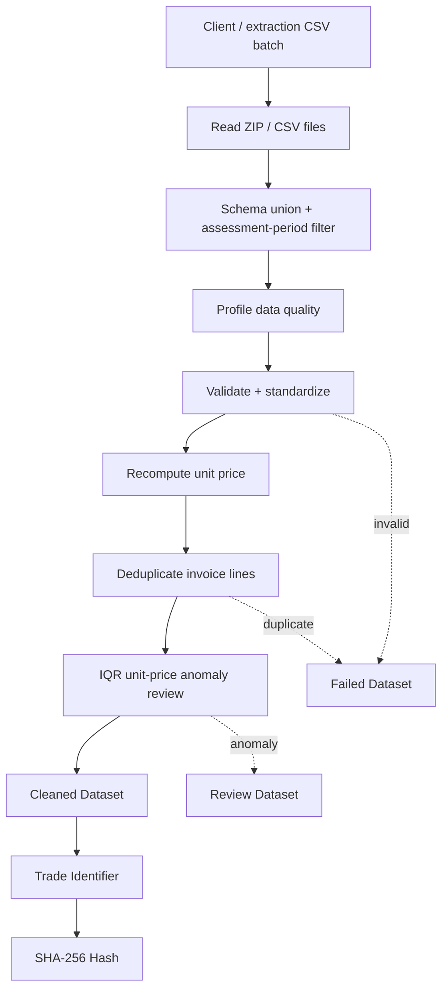

# AWS Trade Data Pipeline

A portfolio-oriented data engineering case study for **post-extraction processing of trade/business documents**. The upstream document-extraction layer or client export produces structured CSV files; this repository starts from those CSVs. The sample data is synthetic and contains no real client data.

- **Part 1:** Python ETL for structured CINV (commercial invoice) CSV batches
- **Part 2:** AWS ingestion and analytics architecture using Fargate, S3, Glue and Athena

## Part 1 — Processing flow



### Canonical source schema (11 columns)

`document_date, buyer_name, document_type, reference_no, seller_name, product_category, quantity, item_description, invoice_year, unit_price, amount`

The included ZIP contains three small synthetic CSV sources. One source intentionally omits `unit_price`; the pipeline unions schemas and recomputes unit price as `amount / quantity`.

### Core rules

- assessment period: `2020-01-01` to `2022-12-31`
- target document type: `CINV`
- normalize text and numeric types
- validate buyer, document type, product category, reference, seller, item, quantity, invoice year and amount
- recompute `unit_price_recomputed = amount / quantity`
- deduplicate using the business columns except `amount`; keep the higher amount and fail the lower record
- anomaly metric: `analysis_unit_price = amount / quantity`
- IQR peer group: `year × buyer_name × product_category`
- anomaly remains in Cleaned and is copied to Review
- generate a compact `trade_identifier` and SHA-256 hash for traceability

## Run

```bash
export PYTHONPATH=src
python -m trade_pipeline.main --input-path data/input/TradeInvoiceCSV.zip --output-dir output
pytest -q
```

## Outputs

```text
output/
├── raw/
├── staging/
├── profiling/
├── cleaned/
├── failed/
├── review/
├── transformed/
├── hashed/
└── run_manifest.json
```

## Part 2 — AWS design

```text
Client secure file-transfer endpoint (modelled as SFTP)
        ↓
EventBridge → Step Functions → ECS Fargate SFTP downloader
        ↓                         ↘ Secrets Manager (SSH credentials)
      S3 Raw
        ↓
AWS Glue / Spark SQL
        ↓
S3 Processed + Glue Data Catalog
        ↓
Athena → Tableau / downstream analytics
```

SFTP is an **architecture assumption for the portfolio case study**, not a claim about any specific client's real transfer mechanism.
