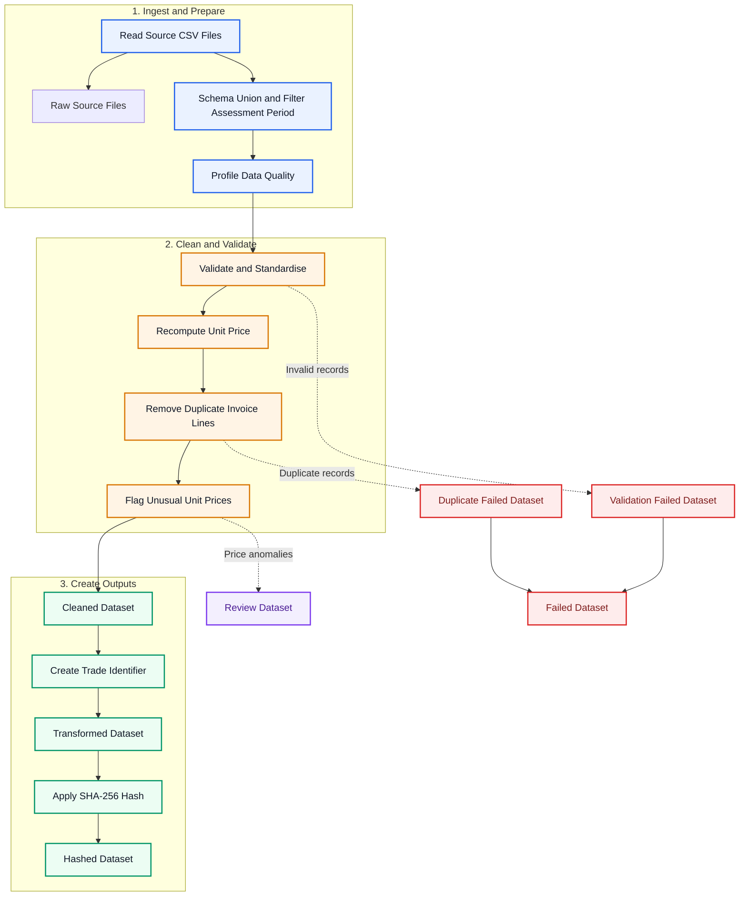
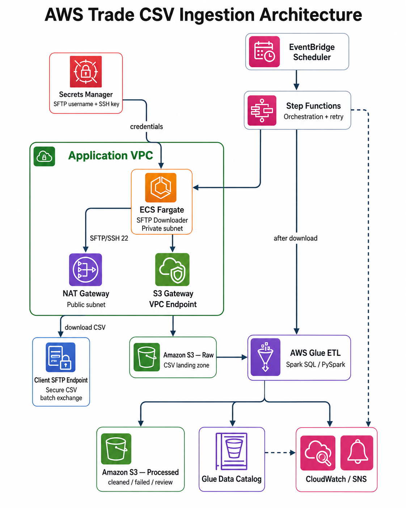
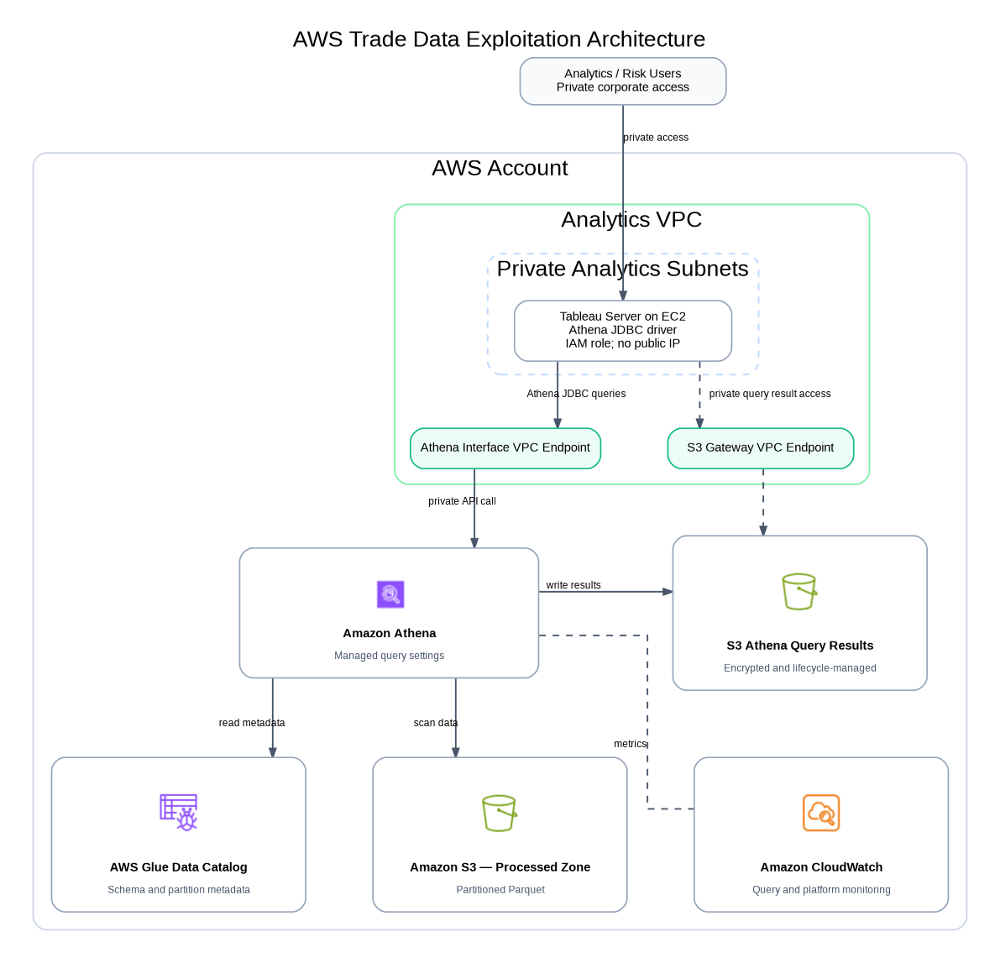

# AWS Trade Document Data Pipeline

This repository demonstrates an end-to-end data engineering solution for **post-extraction processing of structured trade-document data**.

The upstream layer either receives structured CSV exports directly from a client or converts business documents such as **Commercial Invoices (CINV)** and **Inquiries (INQ)** into structured records. This project starts from the CSV layer and focuses on data ingestion, validation, standardisation, deduplication, anomaly review, traceability and AWS-based analytics.

> The sample datasets in this repository are synthetic and do not contain real client data. SFTP is used as an architecture assumption for secure batch file transfer.

- **Part 1:** Developing a Python data pipeline for structured CINV CSV batches
- **Part 2:** Architecting AWS data ingestion and data exploitation solution patterns

## Table of Contents

- [Part 1: Developing Data Pipelines](#part-1-developing-data-pipelines)
  - [Objective](#11-objective)
  - [Processing Flow](#12-processing-flow)
  - [Project Structure](#13-project-structure)
  - [Source Data Model](#14-source-data-model)
  - [Data Processing Rules](#15-data-processing-rules)
  - [Output Datasets](#16-output-datasets)
  - [Environment Setup](#17-environment-setup)
  - [Run the Pipeline](#18-run-the-pipeline)
  - [Run the Notebook](#19-run-the-notebook)
  - [Run Tests](#110-run-tests)
- [Part 2: AWS Architecture](#part-2-architecting-data-ingestion--data-exploitation-solution-patterns)
  - [Data Ingestion Architecture](#21-aws-data-ingestion-architecture)
  - [Data Exploitation Architecture](#22-aws-data-exploitation-architecture)
  - [Design Assumptions](#23-design-assumptions-and-considerations)

---

# Part 1: Developing Data Pipelines

## 1.1 Objective

The pipeline processes structured **Commercial Invoice (CINV)** CSV files within a configurable business assessment period.

It is designed to:

- ingest and combine multiple CINV source files;
- preserve the contributing source files in the Raw output;
- support minor schema variation across source files;
- profile data quality before transformation;
- validate and standardise document, buyer, seller, product and monetary fields;
- recompute unit price from invoice amount and quantity;
- remove duplicate invoice-line records;
- flag potentially unusual unit prices using the IQR method;
- create a compact Trade Identifier;
- generate an irreversible SHA-256 hash of the identifier;
- produce Raw, **Cleaned, Failed, Review, Transformed and Hashed** datasets.

The project focuses on **post-extraction data engineering**. OCR and document parsing are considered upstream responsibilities.

## 1.2 Processing Flow



> The Review dataset is a non-exclusive subset of the Cleaned dataset. A statistical unit-price anomaly is not automatically treated as invalid business data.

## 1.3 Project Structure

```text
.
├── data/
│   └── input/
│       ├── CINV_2020.csv
│       ├── CINV_2021.csv
│       ├── CINV_2022_legacy_schema.csv
│       └── TradeInvoiceCSV.zip
├── notebooks/
│   └── trade_invoice_pipeline.ipynb
├── src/
│   └── trade_pipeline/
│       ├── __init__.py
│       ├── main.py
│       ├── config.py
│       ├── ingestion.py
│       ├── data_quality.py
│       ├── transformation.py
│       ├── output.py
│       └── pipeline.py
├── tests/
│   └── test_pipeline.py
├── output/
├── docs/
│   ├── aws_data_ingestion_architecture.png
│   ├── aws_data_ingestion_architecture.svg
│   ├── aws_data_ingestion_architecture.dot
│   ├── aws_data_exploitation_architecture.png
│   ├── aws_data_exploitation_architecture.svg
│   └── aws_data_exploitation_architecture.dot
├── AWS_Part2_Complete/
│   ├── architecture/
│   ├── ingestion/
│   ├── exploitation/
│   ├── infrastructure/
│   ├── scripts/
│   └── tests/
├── requirements.txt
└── README.md
```

### Python Module Responsibilities

```text
src/trade_pipeline/
├── main.py             # Command-line entry point
├── config.py           # Assessment period and pipeline configuration
├── ingestion.py        # Source discovery, extraction and schema union
├── data_quality.py     # Profiling, validation, deduplication and anomaly detection
├── transformation.py   # Trade Identifier creation and SHA-256 hashing
├── output.py           # Output datasets and run manifest
└── pipeline.py         # End-to-end ETL orchestration
```

## 1.4 Source Data Model

The sample dataset uses a canonical 11-column schema for structured CINV line-item records:

| Column | Description | Example |
|---|---|---|
| `document_date` | Invoice / document date | `2021-04-16` |
| `buyer_name` | Buyer or invoice recipient | `SAKAE KYO PTE LTD` |
| `document_type` | Source business-document type | `CINV` |
| `reference_no` | Invoice / document reference number | `184779` |
| `seller_name` | Seller or supplier | `YOCORN FOOD ENTERPRISE PTE LTD` |
| `product_category` | Standardised product category | `FOOD_PRODUCT` |
| `quantity` | Line-item quantity | `3` |
| `item_description` | Product / item description | `Kyo Shiba Zuke Purple` |
| `invoice_year` | Invoice year | `2021` |
| `unit_price` | Unit price provided by the source, when available | `4.00` |
| `amount` | Line-item total amount | `12.00` |

The processing grain is:

> **One row = one CINV line item.**

The repository includes a legacy-schema sample that intentionally omits `unit_price`. The ingestion layer performs schema union, while the processing layer derives the missing unit price from `amount / quantity`.

## 1.5 Data Processing Rules

### 1.5.1 Ingestion and Profiling

The pipeline reads the input ZIP programmatically, discovers the contributing CSV files and combines them into a canonical master dataset.

The configured assessment period is:

```text
2020-01-01 to 2022-12-31
```

The target document type is:

```text
CINV
```

Minor source-schema differences are handled by aligning source files to the canonical schema and filling unavailable columns with null values where appropriate.

The original contributing CSV files are retained in the Raw output.

Data profiling includes:

- row counts;
- column data types;
- null counts and percentages;
- distinct-value counts;
- categorical distributions for buyer, document type, product category and seller.

### 1.5.2 Validation and Standardisation

Validation rules are applied to:

- `document_date`;
- `buyer_name`;
- `document_type`;
- `reference_no`;
- `seller_name`;
- `product_category`;
- `quantity`;
- `item_description`;
- `invoice_year`;
- `unit_price`;
- `amount`.

The rules cover:

- date parsing and assessment-period validation;
- target document-type validation;
- required business identifiers;
- normalisation of text values;
- numeric conversion;
- positive quantity and amount checks;
- invoice-year consistency;
- category-frequency validation for selected categorical fields.

The current sample configuration uses:

```text
minimum_category_frequency = 2
```

This threshold is configurable and is used to avoid accepting isolated one-off categorical values as trusted domain values in the synthetic case study.

### 1.5.3 Unit Price Recalculation

For valid records, unit price is independently recomputed as:

```text
unit_price_recomputed = amount / quantity
```

If the source `unit_price` is missing, the recomputed value is used.

The pipeline also retains the variance between the source and recomputed values for validation and analytical review.

### 1.5.4 Duplicate Handling

The duplicate business key consists of all canonical business columns except `amount`.

When duplicate keys contain different amounts:

- the higher-amount record is retained;
- the lower-amount record is written to the Failed dataset with failure reason:

```text
DUPLICATE_LOWER_AMOUNT
```

This preserves the deterministic duplicate-resolution rule used by the pipeline.

### 1.5.5 Unit-Price Anomaly Detection

Potential pricing anomalies are identified using the analytical unit price:

```text
analysis_unit_price = amount / quantity
```

Records are grouped by:

```text
year × buyer_name × product_category
```

The Interquartile Range (IQR) method is then applied:

```text
IQR = Q3 - Q1
Lower Bound = Q1 - 1.5 × IQR
Upper Bound = Q3 + 1.5 × IQR
```

Records outside the bounds are flagged as:

```text
POTENTIAL_UNIT_PRICE_ANOMALY_IQR
```

Flagged records remain in the Cleaned dataset and are also copied to the Review dataset because an unusual price may still represent a valid business transaction.

### 1.5.6 Trade Identifier and Hashing

For each valid invoice line, the pipeline generates a compact Trade Identifier from selected business attributes.

The identifier is then encoded using UTF-8 and hashed using SHA-256:

```text
trade_identifier
        ↓ UTF-8
bytes
        ↓ SHA-256
hashed_trade_identifier
```

The hash provides an irreversible traceability key for downstream use without directly exposing the compact business identifier.

## 1.6 Output Datasets

The pipeline produces:

```text
output/
├── raw/
├── staging/
├── profiling/
├── cleaned/
├── failed/
├── review/
├── transformed/
├── hashed/
└── run_manifest.json
```

| Output | Description |
|---|---|
| Raw | Original contributing source CSV files |
| Staging | Combined canonical records within the configured scope |
| Profiling | Data-quality profiles and categorical distributions |
| Cleaned | Valid and deduplicated records |
| Failed | Invalid records and lower-amount duplicates |
| Review | Cleaned records flagged for unit-price review |
| Transformed | Cleaned records with Trade Identifier |
| Hashed | Transformed records with SHA-256 identifier |
| Manifest JSON | Execution metadata, row counts and reconciliation results |

## 1.7 Environment Setup

Run all commands from the project root directory.

Choose either Conda or Python `venv`.

### Option 1: Conda

```bash
conda create -n trade-pipeline python=3.10
conda activate trade-pipeline
pip install -r requirements.txt
```

### Option 2: Python Virtual Environment

```bash
python3 -m venv .venv
source .venv/bin/activate
pip install -r requirements.txt
```

## 1.8 Run the Pipeline

```bash
PYTHONPATH=src python -m trade_pipeline.main \
  --input-path data/input/TradeInvoiceCSV.zip \
  --output-dir output
```

The configurable defaults are defined in `src/trade_pipeline/config.py`.

## 1.9 Run the Notebook

```bash
jupyter notebook notebooks/trade_invoice_pipeline.ipynb
```

The notebook demonstrates pipeline execution, profiling results, output validation and reconciliation checks.

## 1.10 Run Tests

```bash
PYTHONPATH=src pytest -q
```

The tests cover the main processing rules and expected output behaviour.

---

# Part 2: Architecting Data Ingestion & Data Exploitation Solution Patterns

**AWS Data Ingestion & Data Exploitation Architecture**

## 2.1 AWS Data Ingestion Architecture

### 2.1.1 Objective

The solution ingests structured trade-document CSV batches from a **secure client file-transfer endpoint** into Amazon S3.

For this case study, the secure transfer channel is modelled as **SFTP**.

The design supports:

- scheduled batch ingestion;
- authenticated file transfer using managed secrets;
- workloads running in private subnets;
- controlled outbound internet access;
- secure raw-file storage in Amazon S3;
- automated Glue ETL processing;
- logging, monitoring and failure notification.

### 2.1.2 Processing Flow



The workflow is:

1. The client exports structured CINV CSV batches to a secure SFTP endpoint.
2. EventBridge Scheduler starts the Step Functions workflow.
3. Step Functions runs the downloader, packaged as a Docker container, on ECS Fargate.
4. The Fargate task retrieves SFTP connection credentials from AWS Secrets Manager.
5. The downloader connects to the client SFTP endpoint through the NAT Gateway and Internet Gateway.
6. New CSV files are downloaded and written to the S3 Raw Zone.
7. After the download and S3 upload succeed, Step Functions starts the AWS Glue ETL job.
8. AWS Glue implements the same validation, standardisation, deduplication and transformation rules as Part 1.
9. Processed datasets are written to the S3 Processed Zone and registered in the AWS Glue Data Catalog.
10. CloudWatch collects logs and metrics, while Amazon SNS sends failure notifications.

### 2.1.3 Main Components

| Component | Purpose |
|---|---|
| Client SFTP Endpoint | Provides a controlled channel for batch CSV delivery. |
| EventBridge Scheduler | Starts the ingestion workflow on a schedule. |
| Step Functions | Orchestrates the Fargate downloader and Glue ETL job. |
| ECS Fargate | Runs the containerised SFTP downloader without managing EC2 servers. |
| AWS Secrets Manager | Stores SFTP username, password and/or SSH-key material securely. |
| NAT Gateway | Provides controlled outbound internet access from private application subnets. |
| Internet Gateway | Provides the VPC route to the external SFTP endpoint through the NAT Gateway. |
| S3 Gateway VPC Endpoint | Provides private VPC access to Amazon S3. |
| S3 Raw Zone | Stores original CSV batches with controlled access. |
| AWS Glue ETL | Implements the Part 1 processing logic using Spark SQL / PySpark. |
| S3 Processed Zone | Stores processed datasets, preferably in Parquet format. |
| Glue Data Catalog | Stores table, schema and partition metadata. |
| CloudWatch and SNS | Provide logging, metrics, monitoring and failure notifications. |

### 2.1.4 Network Design

The downloader runs in private application subnets and has no public IP address.

Outbound access to the client SFTP endpoint follows:

```text
Private Application Subnet
→ NAT Gateway
→ Internet Gateway
→ Client SFTP Endpoint
```

Access to Amazon S3 follows the private VPC path:

```text
Private Application Subnet
→ S3 Gateway VPC Endpoint
→ Amazon S3
```

SFTP credentials are not hard-coded in the container image or source code. They are retrieved at runtime from AWS Secrets Manager using an IAM role with least-privilege permissions.

## 2.2 AWS Data Exploitation Architecture

### 2.2.1 Objective

The exploitation layer allows internal analysts or downstream users to query processed trade-document data through Tableau and Amazon Athena.

The design supports:

- private access to Tableau;
- serverless SQL queries with Amazon Athena;
- metadata management through AWS Glue Data Catalog;
- partitioned Parquet datasets in Amazon S3;
- controlled query-result storage;
- IAM-based access control, encryption and monitoring.

### 2.2.2 Processing Flow



The workflow is:

1. Internal users access Tableau through an approved corporate network connection or VPN.
2. Tableau runs on Amazon EC2 in a private analytics subnet without a public IP address.
3. Tableau submits SQL queries to Amazon Athena through the Athena JDBC driver.
4. The Athena Interface VPC Endpoint provides private access from the VPC to the Athena API.
5. Athena reads table and partition metadata from the AWS Glue Data Catalog.
6. Athena queries processed trade datasets stored in the S3 Processed Zone.
7. Athena query results are written to a dedicated S3 query-results location.
8. The Athena Workgroup controls result location, encryption and query limits.
9. IAM provides access control, while CloudWatch provides logging and monitoring.

### 2.2.3 Main Components

| Component | Purpose |
|---|---|
| Internal Users | Consume dashboards and analytical results. |
| Tableau on Amazon EC2 | Provides dashboards and submits SQL queries to Athena. |
| Athena JDBC Driver | Connects Tableau to Amazon Athena. |
| Athena Interface VPC Endpoint | Provides private API access from the VPC to Athena. |
| Amazon Athena | Runs serverless SQL queries against data stored in Amazon S3. |
| Athena Workgroup | Controls query settings, result location, encryption and scan limits. |
| AWS Glue Data Catalog | Stores table, schema and partition metadata. |
| S3 Processed Zone | Stores processed trade-document datasets in Parquet format. |
| S3 Athena Query Results | Stores output files produced by Athena queries. |
| S3 Gateway VPC Endpoint | Provides private access from VPC resources to Amazon S3. |
| IAM, KMS and CloudWatch | Provide access control, encryption, logging and monitoring. |

### 2.2.4 Network Design

Tableau runs in a private analytics subnet and has no public IP address.

Internal access follows:

```text
Internal Users
→ Corporate Network / VPN
→ Tableau on Amazon EC2
```

Tableau interacts with Athena through private AWS connectivity where applicable, while Athena queries the processed datasets directly from Amazon S3 as a managed AWS service.

## 2.3 Design Assumptions and Considerations

### 2.3.1 Source and Integration Assumptions

- Source records are already structured before they enter this project.
- Some records may originate from upstream document extraction, while others may be direct CSV exports from client systems.
- This project does not implement OCR or PDF field extraction.
- SFTP is used as a representative secure batch-transfer mechanism for the architecture case study; it is not a claim about any specific client's actual integration method.
- The target analytical document type in the current synthetic dataset is CINV.

### 2.3.2 Security

- ECS Fargate and Tableau run without public IP addresses.
- IAM roles follow the principle of least privilege.
- SFTP credentials are stored in AWS Secrets Manager rather than source code.
- S3 blocks public access and should use SSE-KMS encryption in production.
- VPC endpoints are used for private AWS service access where applicable.
- Raw and processed datasets should be separated by IAM policy and S3 prefix / bucket permissions.

### 2.3.3 Scalability and Reliability

- ECS Fargate scales the downloader without requiring EC2 server management.
- AWS Glue can scale distributed Spark processing as file volume grows.
- Step Functions starts Glue only after ingestion succeeds.
- S3 provides durable raw and processed storage.
- Failed records and statistical-review records are separated from trusted outputs rather than silently discarded.

### 2.3.4 Performance and Cost

- Processed datasets should be stored in Parquet rather than CSV for analytical workloads.
- Partitioning can be applied by invoice year and month for larger datasets.
- Athena partition pruning reduces scanned data and query cost.
- Fargate is appropriate for the short-lived downloader workload, while Glue is used for distributed ETL processing.

### 2.3.5 Auditability and Traceability

The pipeline preserves:

- original raw source files;
- staging datasets;
- profiling results;
- failed records and failure reasons;
- review records and anomaly reasons;
- transformed identifiers;
- SHA-256 hashes;
- run-level metadata and reconciliation counts.

This provides a clear path from source files to analytical outputs and makes the pipeline easier to troubleshoot, validate and audit.

---

## Summary

This project demonstrates a practical separation of responsibilities:

```text
Upstream document extraction / client export
                    ↓
             Structured CSV
                    ↓
        Python / AWS Data Pipeline
                    ↓
Validation → Standardisation → Deduplication → Anomaly Review
                    ↓
       S3 Processed + Glue Catalog
                    ↓
              Athena / Tableau
```

The core design goal is to convert heterogeneous structured trade-document data into **trusted, auditable and analytics-ready datasets** while keeping ingestion, transformation, security and consumption responsibilities clearly separated.
